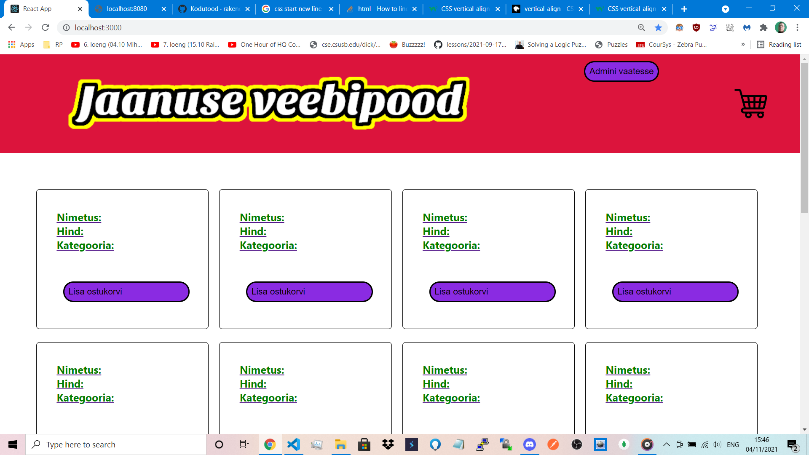
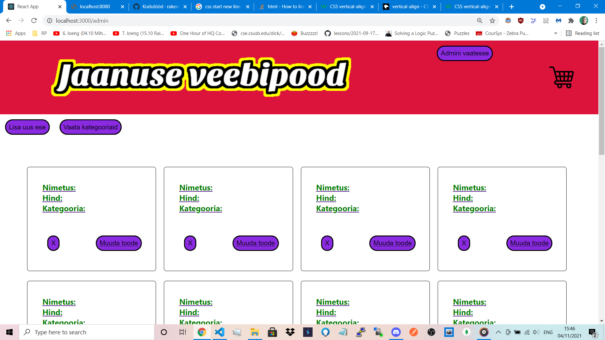
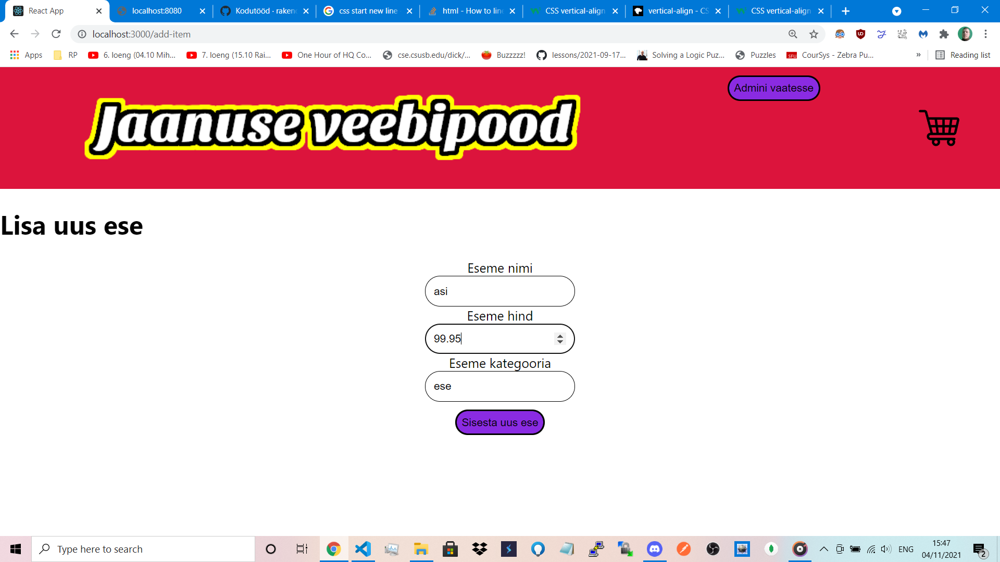

## Projekti kirjeldus:   

Jaanus Lille (paariline veel leidmata)
Nimi: Accountability
Idee: Videosuhtluse rakendus

Kõik registreeritud kasutajad saavad broneerida videokõnesid, mille ajal nad teeksid mingit tööd mida oleks muidu üksi ilma emotsionaalse toeta raske teha üksi. Nagu võimlemine, koristamine või õppimine. 
Sobiks tähelepanuhäiretega inimestele. 
Videokõned oleks kalendris broneeritavad, koos töö kirjeldusega, mida broneerija soovib teha. 
On ka mõte, et kasutajat kes jättis tulemata varem broneeritud videokõnele, trahvitakse mingi rahasummaga. See annaks kasutaja  enesedistsipliini koorma rakenduse kanda. 
On ka mõte lisada valik, kus kasutaja võib sisestada summa, millega teda trahvida kui ta jätab vestlusele ilmumata. 

## Kodutöö 4 ekraanipildid:   

Teatud vea tõttu on toodete asemel tühjad väljad, aga nende kohad on aimatavad. 
Kohe kui viga saab parandatud, peaks leht minema normaalseks. 

  

  

  
